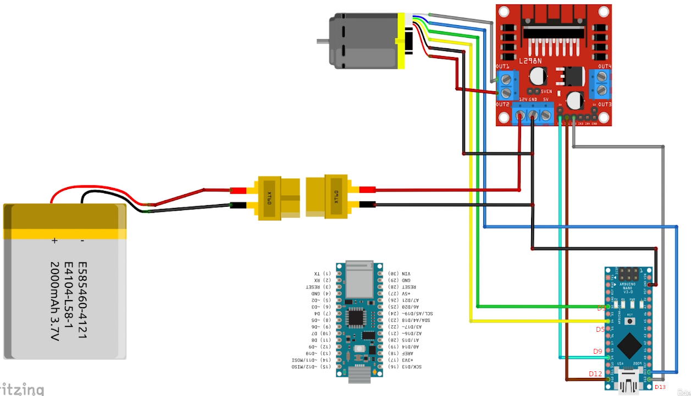

# publish ros2 to arduino LED C++

## How to run

### Arduino

```
#define LED_PIN 13

// use this with ros2 humble SimpleRos2subArduino package.
void setup() {
  // put your setup code here, to run once:
  pinMode(LED_PIN, OUTPUT);
  digitalWrite(LED_PIN, LOW);

  Serial.begin(115200);
}

void loop() {
  // put your main code here, to run repeatedly:
  if(Serial.available()){
    int x = Serial.readString().toInt();
    if(x == 0){
      digitalWrite(LED_PIN, LOW);    
    }else{
      digitalWrite(LED_PIN, HIGH);    
    }
  }
}
```

### Terminal 1

```
ros2 run simple_ros2pubsub_arduino_cpp simple_ros2pubsub_arduino_cpp 
```

### Terminal 2 

- Turn on Arduino Led

```
ros2 topic pub /serial_transmitter std_msgs/msg/String "data: '1'" 
```

- Turn off Arduino Led

```
ros2 topic pub /serial_transmitter std_msgs/msg/String "data: '0'" 
```

### Package created with

```
ros2 pkg create --build-type ament_cmake simple_ros2pubsub_arduino_cpp --dependencies  rclcpp std_msgs  PkgConfig
```


# Encoder Reading C++


### Arduino

```
// L298N H-Bridge Connection PINs
#define L298N_enA 9  // PWM
#define L298N_in2 13  // Dir Motor A
#define L298N_in1 12  // Dir Motor A

#define right_encoder_phaseA 3  // Interrupt 
#define right_encoder_phaseB 5  

unsigned int right_encoder_counter = 0;
String right_encoder_sign = "p";
double right_wheel_meas_vel = 0.0;    // rad/s

void setup() {
  // Set pin modes
  pinMode(L298N_enA, OUTPUT);
  pinMode(L298N_in1, OUTPUT);
  pinMode(L298N_in2, OUTPUT);
  
  // Set Motor Rotation Direction
  digitalWrite(L298N_in1, HIGH);
  digitalWrite(L298N_in2, LOW);

  Serial.begin(115200);

  pinMode(right_encoder_phaseB, INPUT);
  attachInterrupt(digitalPinToInterrupt(right_encoder_phaseA), rightEncoderCallback, RISING);
}

void loop() {
  right_wheel_meas_vel = (10 * right_encoder_counter * (60.0/385.0)) * 0.10472;
  String encoder_read = "r" + right_encoder_sign + String(right_wheel_meas_vel);
  Serial.println(encoder_read);
  right_encoder_counter = 0;
  analogWrite(L298N_enA, 100);
  delay(100);
}

void rightEncoderCallback()
{
  //Serial.println("interrupt_callback");
  if(digitalRead(right_encoder_phaseB) == HIGH)
  {
    right_encoder_sign = "p";
  }
  else
  {
    right_encoder_sign = "n";
  }
  right_encoder_counter++;
}

```

### Hardware connection




### Terminal 1

```
ros2 run simple_ros2pubsub_arduino_cpp simple_ros2sub_arduino_cpp
```


### Terminal 2

```
ros2 topic echo /serial_receiver
```

